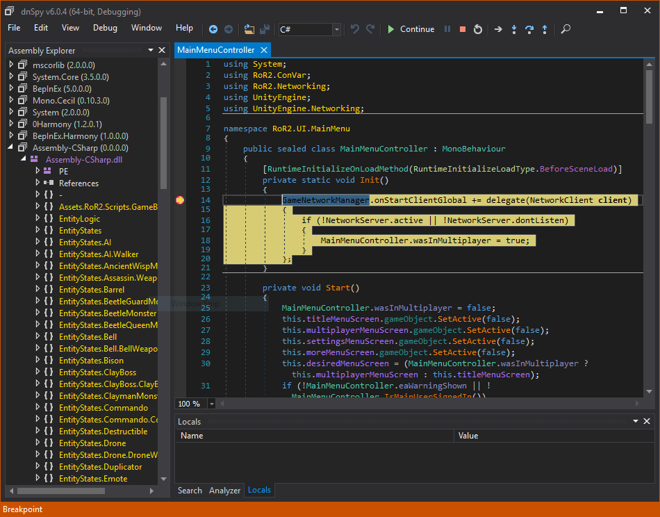

# Debugging patched assemblies

In some cases it is useful to be able to also debug assemblies that have been patched via BepInEx's preloader.  
However, this is very difficult, as the preloader patches and loads assemblies directly in memory, which makes debugging with dnSpy impossible without additional tinkering.

## Using BepInEx `LoadDumpedAssemblies` option

BepInEx includes two new configuration options: `LoadDumpedAssemblies` and `BreakBeforeLoadAssemblies`. With these, it is possible to debug assemblies loaded via the preloader (i.e. Assembly-CSharp).

First [install debug version of mono](<xref:debug_plugin_dnspy#turning-the-game-into-a-debug-build>) and [download dnSpy](https://github.com/0xd4d/dnSpy/releases) if you haven't done so yet.

Run the game once in order for BepInEx to generate its full configuration file.  
Then, open to `BepInEx/config/BepInEx.cfg` and edit the the two configuration options to have the following values:

```ini
LoadDumpedAssemblies = true

BreakBeforeLoadAssemblies = true
```

After that [run the game via dnSpy](<xref:debug_plugin_dnspy>#running-the-game-via-dnspy).

> [!WARNING]
> **The assemblies in `DumpedAssemblies` must not be opened before debugging!** 
> This is because otherwise BepInEx will not be able to write to the folder!

If everything worked, BepInEx will launch, patch assemblies and automatically break the execution and display a message in console:


Now go to `BepInEx/DumpedAssemblies` (as specified in the console), open patched assemblies you want to debug and set breakpoints.
When you're done, click `Continue` in the top bar to continue execution.

BepInEx will continue loading the patched assemblies. If everything worked, you will eventually hit a breakpoint in the patched assembly:




## Using dnSpy's module view

In Debug mode, dnSpy provides the ability to access all assemblies that are loaded in memory.  
That way you are able to access all 
assemblies that were loaded in memory -- even dynamic assemblies (ones generated by Harmony, for example).

When in debug mode, open the modules window by selecting `Debug > Windows > Modules`


The opened tab shows all modules already loaded into memory:


You can open modules by double-clicking them. This opens them in dnSpy, after which you can 
put breakpoints like you normally would.

Finally, it's possible to put breakpoints for when an assembly has been loaded. 
For that, select `Debug > Windows > Module Breakpoints`. This will open a window into which 
you can put the names of the modules to break on.


