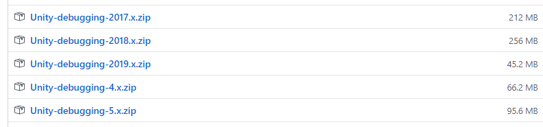
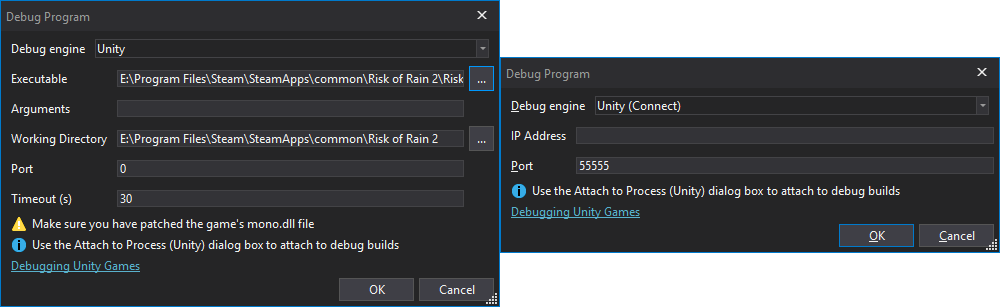

# Debugging with dnSpy

## Turning the game into a debug build

> [!NOTE]
> This guide's step is mainly a basic overview of what to do.
> For a full guide on turning your game into a debug build, check out [the offical dnSpy's guide on this topic.](https://github.com/dnSpyEx/dnSpy/wiki/Debugging-Unity-Games#debugging-release-builds).

First, the game's mono runtime has to be swapped to one that supports debugging with dnSpy.  
For that, you need to know the Unity version your game has been built against.  
You can do that by checking file properties of the game EXE or by running BepInEx, 
which will log the Unity version of the game in the console (or into `BepInEx/LogOutput.txt`):

```
[Message:   BepInEx] BepInEx 5.0.1.0 - <Game Name>
[Info   :   BepInEx] Running under Unity v5.4.0.6710170
[Info   :   BepInEx] CLR runtime version: 2.0.50727.1433
...
```

Next, head to [dnSpy mono builds](https://github.com/dnSpyEx/dnSpy-Unity-mono) and download one of the debug Mono packages
that **corresponds to the Unity version of your game**:

For example, in the log above Unity version is `5.4.0`, in which case one has to download `Unity-debugging-5.x.zip`.

Open the downloaded archive and locate `mono.dll` that corresponds to your Unity game **version** and 
executable target (32 bit or 64 bit). Finally, locate the same DLL in your game folder and replace it with the one from dnSpy.

## Setting up dnSpy and setting breakpoints

Download the [latest version of dnSpy](https://github.com/dnSpyEx/dnSpy/releases). You can pick any of the available versions.
At the moment, the latest and greatest version of dnSpy is available on the dnSpyEx fork.

Extract the downloaded archive and run dnSpy.

Next, drag the plugins DLLs you want to debug into dnSpy.

> [!NOTE]
> You must select the DLL that is in your `BepInEx` folder, and not the one in your Visual Studio solution!


You can change the settings of dnSpy via `View > Options`.

To set a breakpoint, navigate the assembly you want to debug and right click on the piece of code you want to debug.  
Next, select `Add breakpoint` to set the breakpoint:


Note that some code might not be selectable. In that case you can change dnSpy to show the precise IL code from the dropdown in the top bar.

## Running the game via dnSpy

After you have set the breakpoints, you can start debugging the game.

Select `Debug > Start Debugging` to open up the *Debug Program* dialog.

Change the settings as follows:

* *Debug Engine*: Select **one** of the following:
    * `Unity` if you want dnSpy to start the game for you
    * `Unity (Connect)` if you want to start debugging when the game is on 
* *Executable* (only in `Unity` engine): Locate and select the game's executable from the game's installation directory.
* *Timeout (s)* (only in `Unity` engine): 30. You can optionally set it to higher values if the game loads too slow.
* *IP Address* (only in `Unity (Connect)` engine): Leave it blank
* *Port* (only in `Unity (Connect)` engine): 55555



Finally, press `OK` to start the game (or to attach dnSpy to an already running game).

Wait until the game loads your assembly. If everything worked correctly, the execution will stop on the breakpoint:


From there, you can do same things like in the normal debugger:

* Inspect locals and type members
* Step into, step over, set more breakpoints (via the top bar)
* Modify values (in some cases)

Note that when you step in dnSpy, it steps one IL instruction at a time (in which case one single expression can take multiple steps to move over).
