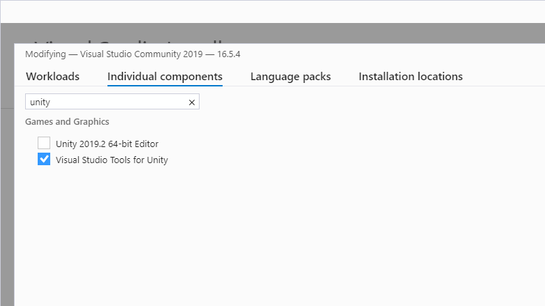
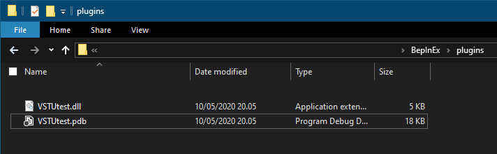
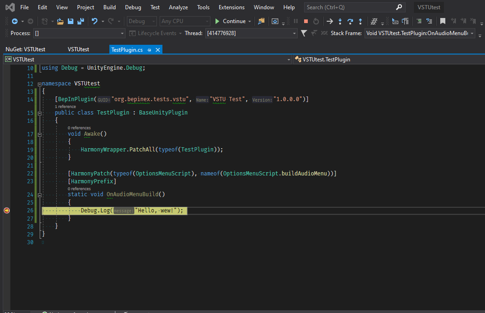

# Debugging plugins with Visual Studio Tools for Unity

> [!NOTE]  
> This method is suitable for debugging only BepInEx plugins!
> To debug preloader plugins, refer to [dnSpy debug guide](<xref:debug_assemblies_dnSpy>).

While debugging with dnSpy is rather simple, you might want to debug directly in 
Visual Studio while developing. It is possible to debug your plugins with the help of 
Visual Studio Tools for Unity (VSTU).

## Installing required tools

First, you have to convert the game to debug build. To do that, [refer to dnSpy guide on converting the game to pure debug build](https://github.com/0xd4d/dnSpy/wiki/Debugging-Unity-Games#turning-a-release-build-into-a-debug-build).

Next, install VSTU. You can do so in Visual Studio 2019 via Visual Studio Installer.
You can find the component behind `Individual components` tab:

> [!NOTE]  
> Rider provides a similar Unity extension which allows for the same debugging functionality.

## Compiling your project

Next, compile your BepInEx plugin with a `Debug` build. **Make sure that you generate a `.pdb` file!**

Place your BepInEx plugin into `BepInEx\plugins` like you normally would but with the `.pdb` file accompanying it:

## Converting `.pdb` to `.mdb`

Since Unity uses Mono as its .NET runtime, it cannot directly read `.pdb` files which contains the required debug symbols.
Instead, it uses `.mdb` files for the similar task. Because of this, `.pdb` file needs to be converted.

Grab `pdb2mdb` converter (for example, from [NuGet](https://www.nuget.org/packages/Mono.pdb2mdb/) or from [GitHub](https://gist.github.com/jbevain/ba23149da8369e4a966f#file-pdb2mdb-exe)). Put the executable in some folder **except not into BepInEx plugin folder**.

Finally, simply drag-and-drop your plugin DLL file, which will generate the required debug symbols:

After this, you can optionally delete the `.pdb` file as it is not needed.

## Starting debugging

Finally, put breakpoints in Visual Studio however you want and start the game.
When the game has started, you're ready to start debugging.

In Visual Studio, select `Debug > Attach Unity Debugger`:

In the opened dialog, select the game executable and press `OK`:

> [!NOTE]  
> If there is no processes in the list, try pressing `Refresh` -- it might be that the game hasn't loaded in yet.  
> It is also may be because you didn't follow the [dnSpy debug build conversion guide](https://github.com/0xd4d/dnSpy/wiki/Debugging-Unity-Games#turning-a-release-build-into-a-debug-build) properly. 
> In that case, please repeat the steps in that setup guide making sure you use correct Unity version and bitness.

If you've done everything correctly, the debugging session starts and your breakpoints can be hit:

