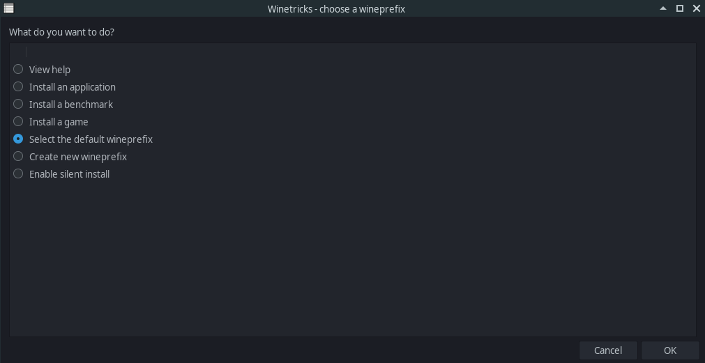

## Proton/Wine

If you are playing a Windows game on an Unix system (Linux/Mac/SteamOS/etc.) the game 
will have to run through a compatibility layer (Proton, or its predecessor Wine) which 
at the moment will likely prevent BepInEx from starting. This is because UnityDoorstop 
relies on dll files inside the game directory being loaded instead of system dlls, but
under Proton/Wine this behavior does not happen by default. To make BepInEx work it's 
necessary to configure this DLL forwarding to work correctly.

**We strongly recommend to use Proton**, but it is not an absolute requirement.

> [!NOTE]
> Instructions on using BepInEx with proton are based on a guide from 
> [R2Wiki](https://github.com/risk-of-thunder/R2Wiki/wiki/Getting-BepInEx-Console-Working-on-Linux)

### 1. Open winecfg for the target game

With proton the easiest way to do so is via 
[`protontricks`](https://github.com/Matoking/protontricks) 
(or similarly with `winetricks` which is not covered here). 
Open the terminal and type

```sh
protontricks --gui
```

> [!NOTE]
> If you have a Steam Deck, the `protontricks --gui` command most likely won't work. Instead, you need to install protontricks via discovery store, and then launch it via the Steam search bar. Launching it via discovery store won't work.
> 
> If you managed to make this guide work on Steam Deck please let us know of any differences, or consider submitting an edit!

Next, select the game you want to configure


Next, in winetricks menu select `Select default wineprefix` option and press OK:



Finally, select `Run winecfg` and click OK:


This will open winecfg.

### 2. Configure proxy to run

BepInEx relies on `winhttp.dll` proxy DLL to inject itself into Unity games. 
On wine the proxy should be configured manually.

In winecfg, select `Libraries` tab. Under `New override for library` dropbox, 
select `winhttp` and `Click` add:


Finally click `Apply` and you're done. Running the game should now run BepInEx.
