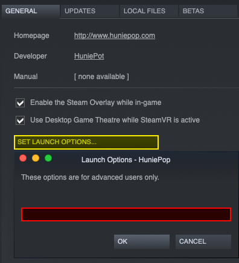

## Unix platforms (native games)

On Unix platforms, Steam provides a way to run launch scripts directly 
before running the original game. The process is similar for both 
Linux and macOS, but with one key difference.

### 1. Download and install BepInEx

First, download and install BepInEx binaries if you hadn't done so.  
For that, follow steps 1-2 in the [installation guide](<xref:installation>#installing-bepinex)

> [!TIP]
> To easily find the game folder of a Steam game, go into properties of the game:  
>   
>  
> And Select `Browse local files` from `Local files` tab:  
> 

> [!NOTE]
> Don't run the script yet as it will run the game without Steam integration.
> You don't need to configure the script either, as it will be done by Steam.

### 2. Set up permissions

On Unix systems, you first need to give the run script permission to run.  
At this moment it has to be done manually.

Open the game folder in terminal and add execution permission to run script:

```sh
chmod u+x run_bepinex.sh
```

This will add needed permissions to run BepInEx.

### 3. Configure Steam to run the script

Finally, configure Steam to run the script.  
Open the game's properties on Steam:


Next, click `Set launch options` button which will open a new window:



Now, change the launch options depending on your OS:

#### [Linux](#tab/tabid-1)
Set the launch option to
```
./run_bepinex.sh %command%
```

#### [macOS](#tab/tabid-2)
First, open a terminal in the game folder and run
```sh
pwd
```
This will print the full path to the game folder. Copy it.

Next, set launch option to
```
"<PWD>/run_bepinex.sh" %command%
```
**where `<PWD>` is the full path to the game folder you got above.**
***

### 4. Run first time to generate configuration

Finally, run the game via Steam normally. 
This will generate BepInEx config, but the game might not run.

### 5. Configure BepInEx to suit your needs.

Open `BepInEx/config/BepInEx.cfg` in a text editor of your choice. 
All options are documented directly in the configuration file.

Additionally, refer to refer to the [configuration guide](<xref:configuration>) for more information.

## Proton/Wine

> [!NOTE]
> Instructions on using BepInEx with proton are based on a guide from 
> [R2Wiki](https://github.com/risk-of-thunder/R2Wiki/wiki/Getting-BepInEx-Console-Working-on-Linux)

Setting up BepInEx with Wine requires primarily configuring the DLL forwarding 
to work correctly. **We strongly recommend to use Proton**, but it is not an 
absolute requirement. Please note that when using BepInEx under proton, the windows version of BepInEx must be downloaded.

### Adding the DLL override
#### Using the Steam launch options

If you are using proton with steam, you can specify the DLL override in the launch options:
```WINEDLLOVERRIDES="winhttp.dll=n,b" %command%```

With this method you can ignore the last steps since you are not using winecfg. (Thanks to the comments on [ProtonDB](https://www.protondb.com/app/1966720) for this method!)

#### Using protontricks to open winecfg

With proton the easiest way to do so is via 
[`protontricks`](https://github.com/Matoking/protontricks) 
(or similarly with `winetricks` which is not covered here). 
Open the terminal and type

```sh
protontricks --gui
```

Next, select the game you want to configure


Next, in winetricks menu select `Select default wineprefix` option and press OK:


Finally, select `Run winecfg` and click OK:


This will open winecfg. Proceed to the last step to configure the proxy to run.

#### Using the command line to open winecfg

To open winecfg from the command line for your games prefix use the following command:

```env WINEPREFIX="<steamapps folder>/compatdata/<appid>/pfx" WINEPATH="<steamapps folder>/common/<proton folder>/files/bin/wine64" winecfg```

Replace \<steamapps folder\> with the path to your steamapps folder, \<appid\> with the appid of the game and \<proton folder\> with the folder name of the proton version to use.

### Configure proxy to run

BepInEx relies on `winhttp.dll` proxy DLL to inject itself into Unity games. 
On wine the proxy should be configured manually.

In winecfg, select `Libraries` tab. Under `New override for library` dropbox, 
select `winhttp` and `Click` add:


Finally click `Apply` and you're done. Running the game should now run BepInEx.
