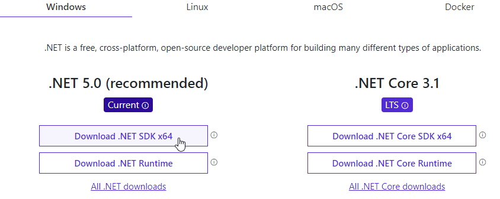

# Setting up the development environment

To start developing BepInEx, we need three components:

* Latest .NET SDK
* A code editor or an integrated development environment (IDE)
* BepInEx installed and configured in the game
* BepInEx plugin templates

All these parts are next discussed in more detail

## .NET SDK

> [!NOTE]
> If you have .NET SDK (version 6 or newer) already installed, you can continue to [picking an IDE](#picking-an-ide).

[.NET SDK](https://dotnet.microsoft.com/) is a software development kit (SDK) that allows compiling code written in C# and using different .NET libraries.
As you may notice later, plugins use different .NET API versions and variations such as *.NET Framework* or *.NET Standard*.
When it comes to plugin development, all those can be handled by the modern .NET SDK.

To install .NET SDK, do the following:

1. Head to [.NET downloads page](https://dotnet.microsoft.com/download)

2. Select the latest recommended .NET SDK for your OS:

    

3. Download and run the installer according to your OS's instructions

    You may need to restart your PC for the install to finalise.

Once you have installed .NET SDK, verify that it works by opening a command line prompt and running

```bash
dotnet --list-sdks
```

If you have installed .NET SDK correctly, the command should return at least one .NET SDK version and its location.  
An example output is:

```txt
6.0.1 [C:\Program Files\dotnet\sdk]
```

Once you have at least one .NET SDK version installed, you can choose a code editor.

## Picking an IDE

While plugins can be made with a simple text editor, it is recommended to use a proper editor for programming.  
Different editors exist with varying level of integration with .NET building tools.
Proper IDEs provide more extensive features like code style suggestions, automatic completions and even debugging.

A list of some editors that are known to be usable for BepInEx plugin development:

* [Visual Studio Community](https://visualstudio.microsoft.com/) -- free, code completions, project management, debugging support
* [JetBrains Rider](https://www.jetbrains.com/rider/) -- paid, great code completion, code style suggestions, C# decompiler, crossplatform (Windows, macOS, Linux)
* [Visual Studio Code](https://code.visualstudio.com/) -- free and lightweight, crossplatform (Windows, macOS, Linux), supports .NET and C# via plugins

Pick one of the code editors and ensure they work with C#.

## Installing and configuring BepInEx

Next, make sure you have BepInEx installed in your game.  
If you don't have yet, follow the [installation guide](<xref:installation>).

Run the game with BepInEx at least once in order to generate configuration files and any additional libraries.

To make debugging easier, it is useful to enable the BepInEx console. 
To do so, go to `BepInEx/config` folder and open `BepInEx.cfg`.  
Find the following configuration section/value and edit it as follows:

```ini
[Logging.Console]

## Enables showing a console for log output.
# Setting type: Boolean
# Default value: false
Enabled = true
```

## Installing BepInEx plugin templates

BepInEx provides helper templates to start off with plugin development.  
We will be using them to make our plugins.

To install the template, run the following command:

```bash
dotnet new -i BepInEx.Templates --nuget-source https://nuget.bepinex.dev/v3/index.json
```

If the install is successful, you should see a listing of all .NET project templates.
Among them should be the following BepInEx templates:

```txt
Templates                                     Short Name            Language    Tags
--------------------------------------------  --------------------  ----------  --------------------------------------
BepInEx 5 Plugin Template                     bepinex5plugin        [C#]        BepInEx/BepInEx 5/Plugin
BepInEx 6 .NET Launcher Plugin Template       bep6plugin_netfx      [C#]        BepInEx/BepInEx 6/Plugin/.NET Launcher
BepInEx 6 Il2Cpp Plugin Template              bep6plugin_il2cpp     [C#]        BepInEx/BepInEx 6/Plugin/Il2Cpp
BepInEx 6 Unity Mono Plugin Template          bep6plugin_unitymono  [C#]        BepInEx/BepInEx 6/Plugin/Unity Mono
```

## Summary

In this part, we installed .NET SDK, a code editor, BepInEx and BepInEx plugin templates.
With all components set up, creating a new plugin is a fairly simple process.

Next: [Writing a basic plugin](2_plugin_start.md)
