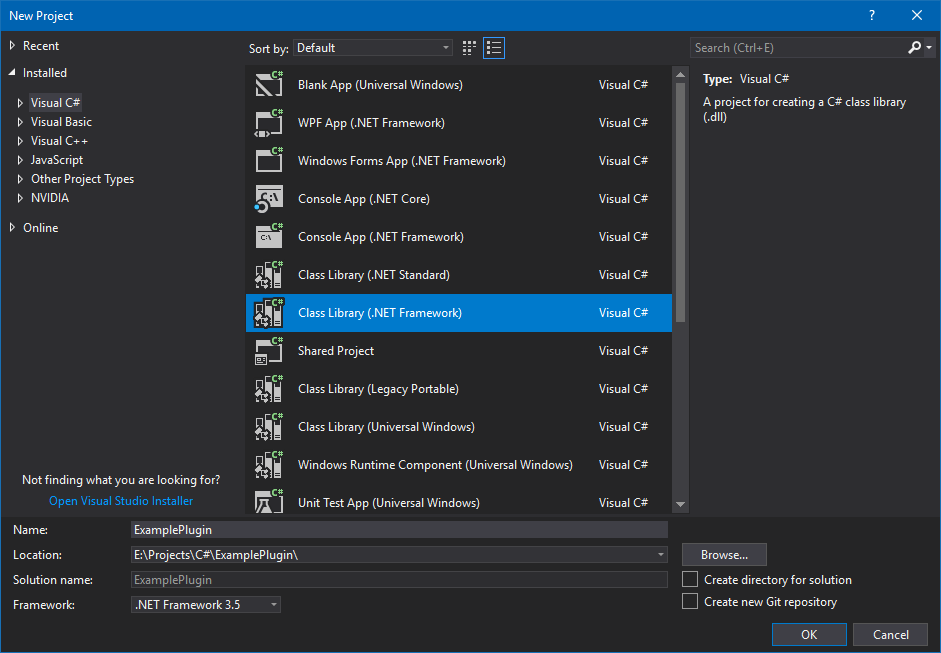
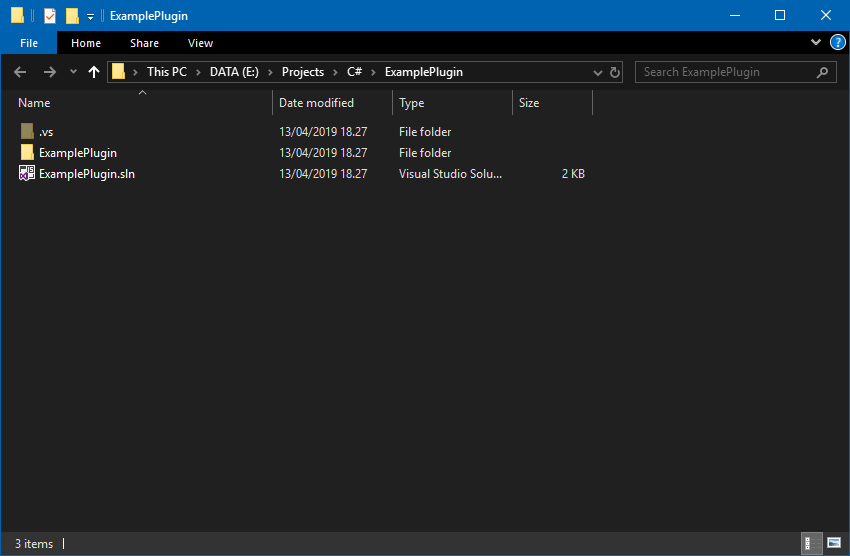
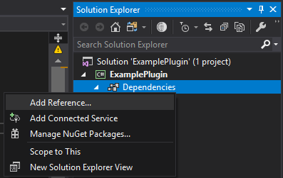
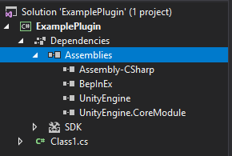

# Setting up the development environment

Writing BepInEx plugins starts with creation of the code projects.
In this guide, we will be using [Visual Studio](https://visualstudio.microsoft.com/) to create our plugins.

## Creating a solution

First, we'll create a new solution in Visual Studio.  
Open up Visual Studio and select `File > New > Project`:

From there, select `C# > Class Library` as the target project.
You might now notice that there are multiple `Class Library` templates: one for .NET Standard, one for .NET Framework and some other ones.  
The one you select *depends on the game and on the plugin you're trying to create*.

In essence, select *Class Library (.NET Standard)* if the game you're targeting has `netstandard.dll` present in its `<GameName>_Data\Managed` folder.  
Otherwise, select *Class Library (.NET Framework)*.

Next, fill in the details of your plugin (name, project location).  

If you have selected *Class Library (.NET Framework)* as the project type, you will also notice the `Framework` option.
This option specifies the version of the .NET Framework that the plugin will be compiled against.  
Different Unity may require you to use different .NET Framework versions. As a rule of thumb, you can use .NET Framework 3.5 in all Unity games, but you will get the least API available. In order to determine the exact version of .NET Framework to use, check the file version of `mscorlib.dll` in `<GameName>_Data\Managed` folder: if it's `4.0.0.0` or newer, you can target .NET Framework 4.x (usually 4.6).

> [!NOTE]
> It is possible to target both .NET Framework and .NET Standard games by using .NET Framework 3.5 as the build target.

In the case of this test plugin, we'll be writing a plugin for [Risk of Rain 2](https://store.steampowered.com/app/632360/Risk_of_Rain_2/).  
Since Risk of Rain 2 is a .NET Standard game (i.e. there is `netstandard.dll` in `Risk of Rain 2_Data\Managed` folder), we will choose *Class Library (.NET Standard)* as the template.

Press OK, which will create the solution folder and the main C# project.

## Gathering DLL dependencies

Before diving into programming, we need to import any DLLs that we will be using.

First, head over to the folder you created your solution in. It should look like this:

> [!TIP]
> If you forgot the location of the solution, you can right click on the solution file in Visual Studio and select `Open Folder in File Explorer`:
> 

Next, create a `Libs` folder in the solution folder. That folder will contain all the required DLLs that this project will depend on.

Find and copy the following DLLs into the folder:

* `BepInEx.dll`: found in `BepInEx\core` folder (you can download BepInEx as per the [installation instructions](<xref:installation>))
* `UnityEngine.dll` (and `UnityEngine.CoreModule.dll` if needed): found in the game's `<Game Name>_Data\Managed` folder
* (Optional) Any additional DLLs and dependencies you think you need (you can always add more DLLs later)
    - `Assembly-CSharp.dll` contains game-specific code
    - `0Harmony.dll` and `BepInEx.Harmony.dll` allow to patch methods while the game is running. Refer to [Harmony wiki](https://github.com/pardeike/Harmony/wiki) for more details.

In the end, your `Libs` folder might look something like this (**for example**):

> [!WARNING]
> If you are planning on publishing the source code, do not include the DLLs in the `Libs` folder.  
> Not only is it unnecessary, but `Assembly-CSharp.dll` contains game code, which technically is illegal to share without an explicit permission from the game developers.
>
> If you absolutely must include the DLLs, it is suggested to remove the code and only distribute the API contents.

## Importing DLL dependencies into the project

Finally, open your solution in Visual Studio. In there, right click on the `Dependencies` item in the Solution Explorer (or `References` if your project is based on .NET Framework) and select `Add Reference...`:

In the opened Reference Manager, click the `Browse...` button, locate and select *all* assemblies in `Libs` folder and click `Add`.  
Finally, click OK to close the Reference Manager and you will have all your dependencies imported:

