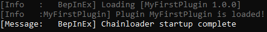

# Creating a new plugin project

Once all required tools are installed, it is time to create a new project.
BepInEx plugins require at least one C# file which is annotated with @BepInEx.BepInPlugin.
In addition, to make plugins code compile, we need to *reference* BepInEx libraries and game-specific libraries.

To make the process easier, we will use a ready plugin template from [BepInEx.Templates](https://nuget.bepinex.dev/packages/BepInEx.Templates) package.
The templates already include a premade C# file and BepInEx-specific libraries referenced.

In this section, we will

* create a new project,
* go through the structure and metadata of a plugin, and
* reference game-specific libraries,
* build and verify that the plugin is loaded by the game.

## Initializing a plugin project from template 

Create a new folder for your project. As an example, we will use a project name `MyFirstPlugin`.

Open a command line prompt in the folder.  
To create a project in the folder, do the following depending on the game type you're modding:

# [Unity (Mono)](#tab/tabid-unitymono)

1. Determine *.NET target framework* (TFM) for your plugin.
    
    You can follow this general-purpose choice process:

    * If the game has `netstandard.dll` in `<Game Name>_Data/Managed` folder, your TFM is `netstandard2.0`. If you run into reference errors, target `net472`.  
    **OR**  
    * If the game's `mscorlib.dll` file version (right click the file -> `Properties` -> `Details`) is at least `4.0.0.0` or newer, your TFM is `net46`  
    **OR**  
    * In any other case, or if you are unsure/unable to verify using the methods above, your TFM is `net35`

    > [!NOTE]
    > As a general rule, you can always target `net35`.
    > However, the lower TFM, the less standard libraries and methods are available to you.

2. Determine *Unity version* of your game (in format `X.Y.Z` where `X`, `Y` and `Z` are integers. e.g. `2020.3.24`).
   
   There are a few ways of doing it:

   * Run the game with BepInEx once. BepInEx usually outputs game's Unity version in the console.
   * Check file version of the game executable (right click the file -> `Properties` -> `Details`)
   * Open `<Game Name>_Data/globalgamemanagers` in a text editor like Notepad. You will see some garbage text, but at the start there should be a clear version number readable. 

3. In the command line prompt, run

   ```bash
   dotnet new bep6plugin_unitymono -n MyFirstPlugin -T <TFM> -U <Unity>
   dotnet restore MyFirstPlugin
   ```

   where 

   * `<TFM>` is the TFM determined in step 1
   * `<Unity>` is the Unity version determined in step 2

# [Unity (Il2Cpp)](#tab/tabid-unityil2cpp)

In the command line prompt, run

```bash
dotnet new bep6plugin_il2cpp -n MyFirstPlugin
dotnet restore MyFirstPlugin
```

# [.NET Framework](#tab/tabid-netfw)

In the command line prompt, run

```bash
dotnet new bep6plugin_netfx -n MyFirstPlugin
dotnet restore MyFirstPlugin
```

***

This will create a new folder named `MyFirstPlugin` that contains three files:

* `Plugin.cs`: Main plugin file. You can add more C# source files (`.cs`) as needed.
* `MyFirstPlugin.csproj`: Plugin project configuration
* `NuGet.Config`: Configuration file for NuGet package manager

If you use an IDE, you can proceed to open `MyFirstPlugin.csproj` or the entire folder in it.  
If the IDE has .NET development support, it should automatically pick up the project settings.

Feel free to open the generated files in a text editor and inspect their contents.
You don't need to know what everything means, but it is useful to note the general format of each file.

## Plugin structure

The main plugin file is located in `Plugin.cs`.
Let's inspect the contents of a basic plugin and plugin metadata.

Plugin's structure depends slightly on the game type you chose to target, but the overall layout is the same:

# [Unity (Mono)](#tab/tabid-unitymono)

```cs
using BepInEx;

namespace MyFirstPlugin
{
    [BepInPlugin(PluginInfo.PLUGIN_GUID, PluginInfo.PLUGIN_NAME, PluginInfo.PLUGIN_VERSION)]
    public class Plugin : BaseUnityPlugin
    {
        private void Awake()
        {
            // Plugin startup logic
            Logger.LogInfo($"Plugin {PluginInfo.PLUGIN_GUID} is loaded!");
        }
    }
}

```

# [Unity (Il2Cpp)](#tab/tabid-unityil2cpp)

```cs
using BepInEx;
using BepInEx.IL2CPP;

namespace MyFirstPlugin
{
    [BepInPlugin(PluginInfo.PLUGIN_GUID, PluginInfo.PLUGIN_NAME, PluginInfo.PLUGIN_VERSION)]
    public class Plugin : BasePlugin
    {
        public override void Load()
        {
            // Plugin startup logic
            Log.LogInfo($"Plugin {PluginInfo.PLUGIN_GUID} is loaded!");
        }
    }
}

```

# [.NET Framework](#tab/tabid-netfw)

```cs
using BepInEx;
using BepInEx.NetLauncher;

namespace MyFirstPlugin
{
    [BepInPlugin(PluginInfo.PLUGIN_GUID, PluginInfo.PLUGIN_NAME, PluginInfo.PLUGIN_VERSION)]
    public class Plugin : BasePlugin
    {
        public override void Load()
        {
            // Plugin startup logic
            Log.LogInfo($"Plugin {PluginInfo.PLUGIN_GUID} is loaded!");
        }
    }
}
```

***

As we can see, a BepInEx plugin contains three main parts:

* A class that inhertis one of BepInEx plugin classes (@BepInEx.BaseUnityPlugin, @BepInEx.IL2CPP.BasePlugin or @BepInEx.NetLauncher.BasePlugin );
* @BepInEx.BepInPlugin attribute and other metadata;
* Plugin startup code or other code.

You are free to change main plugin code.

> [!TIP]
> In Mono Unity, @BepInEx.BaseUnityPlugin inherits [UnityEngine.MonoBehaviour](https://docs.unity3d.com/ScriptReference/MonoBehaviour.html).  
> As such, you can use the same event methods like `Awake`, `Update` and so on.

Next, let us discuss a bit the metadata that can be specified in BepInEx.

## Specifying metadata with attributes

Some basic information is needed for BepInEx to know how to load the plugin and to allow plugins to interact.
Such information is commonly *plugin name*, *a unique identifier* and *plugin version*.
Additionally, plugins might need to specify constraints such as dependencies and game names on which plugin can run.

In BepInEx, this information is by setting *C# attributes* to the plugin class.  

Let's go over some of the most important attributes you might want to use. 
For more attributes and detailed documentation, visit the [API docs](~/api/index.md).

### Basic information about the plugin

The most crucial attribute is @BepInEx.BepInPlugin. **Without it, BepInEx will simply ignore loading of the plugin!**

Here's a simple example of the attribute:

```csharp
[BepInPlugin("org.bepinex.plugins.exampleplugin", "Example Plug-In", "1.0.0.0")]
public class ExamplePlugin : BaseUnityPlugin
```

The attribute consists of three string parameters that are:

| Parameter name | Description                                                                                                                                                                                                                                                                                                |
| -------------- | ---------------------------------------------------------------------------------------------------------------------------------------------------------------------------------------------------------------------------------------------------------------------------------------------------------- |
| `GUID`         | A unique identifier of the plugin. **It absolutely must be unique** as BepInEx uses it to detect duplicate plugins and sort dependencies. It is recommended (but not mandatory) to use the [reverse domain name notation](https://docs.oracle.com/javase/tutorial/java/package/namingpkgs.html) for GUIDs. |
| `Name`         | A human-readable name of the plugin.                                                                                                                                                                                                                                                                      |
| `Version`      | Version of the plugin. The version format **must** follow [semver](https://semver.org/)                                                                                                                                                                                                                    |

> [!IMPORTANT]
> Avoid changing plugin GUIDs after you have released your plugin.
> 
> GUIDs are meant to be unique and permanent for a plugin. As you will see with other metadata attributes, other plugins depend on your GUID to be the same.
> From a practical point of view, avoid changing your plugin DLL's name as well!

> [!NOTE]
> You might have noticed that our template has the attribute defined as follows:
> ```csharp
> [BepInPlugin(PluginInfo.PLUGIN_GUID, PluginInfo.PLUGIN_NAME, PluginInfo.PLUGIN_VERSION)]
> ```
> The plugin template from [BepInEx.Templates](https://nuget.bepinex.dev/packages/BepInEx.Templates) contains a helper tool that automatically generates `PluginInfo` from information located in the `.csproj` file.
> For example, the plugin's version is automatically set from `<Version>` component in the project configuration.  
> You can use the helper tool or replace it with your own values at any time.

### Specifying dependencies on other plugins

Sometimes you might want to load some plugins before other ones. 
Moreover, you may want to ensure that a user has installed some other plugin for yours to function.

You can specify dependencies on other plugins with @BepInEx.BepInDependency attribute.  
You can specify the attribute multiple times for multiple dependencies.

Here's a simple example of the attribute:

```csharp
[BepInPlugin("org.bepinex.plugins.exampleplugin", "Example Plug-In", "1.0.0.0")]
[BepInDependency("com.bepinex.plugin.important")]
public class ExamplePlugin : BaseUnityPlugin
```

The attribute consists of only two parameters:

| Parameter name   | Description                                                                                                                                                                                                                                                                                                  |
| ---------------- | ------------------------------------------------------------------------------------------------------------------------------------------------------------------------------------------------------------------------------------------------------------------------------------------------------------ |
| `DependencyGUID` | The GUID of the plugin that yours depends on. Must be in the exact same format and case as defined in the dependency.                                                                                                                                                                                        |
| `Flags`          | *Optional.* Specifies a flag from @BepInEx.BepInDependency.DependencyFlags that tells how to handle missing dependencies. A *soft dependency* means that the plugin can be loaded even if the dependency is missing. A *hard dependency* means that a plugin must be skipped if the dependency is missing.   |
| `VersionRange`   | *Optional.* Specifies the version range of the dependency that your plugin supports. For version ranges, use [node version range syntax](https://docs.npmjs.com/cli/v6/using-npm/semver#ranges).                                                                                                             |

You can specify the attribute multiple times for each dependency. A more involved example:

```csharp
[BepInPlugin("org.bepinex.plugins.exampleplugin", "Example Plug-In", "1.0.0.0")]

// A soft dependency. Loading won't be skipped if it's missing.
[BepInDependency("com.bepinex.plugin.somedependency", BepInDependency.DependencyFlags.SoftDependency)]
// A hard dependency. Loading will be skipped (and an error shown) if the dependency is missing.
[BepInDependency("com.bepinex.plugin.importantdependency", BepInDependency.DependencyFlags.HardDependency)]
// If flags are not specified, the dependency is **hard** by default
[BepInDependency("com.bepinex.plugin.anotherimportantone")]
// Depends on com.bepinex.plugin.versioned version 1.2.x
[BepInDependency("com.bepinex.plugin.versioned", "~1.2")]
public class ExamplePlugin : BaseUnityPlugin
```

### Filtering executables

In some cases, you may want to allow to load the plugin only in certain games. 
For instance, your plugin only works in one game, and you want to prevent users from installing a plugin into the wrong one.
Alternatively, there might be multiple games in the same game folder, and you want to load your plugin only in one of those games.

You can specify what games to load the plugin on with @BepInEx.BepInProcess attribute.

The attribute has only one parameter: `ProcessName`, which is simply the name of the process that the plugin is allowed to run on (including the `.exe` extension).  
Naturally, you can specify the attribute multiple times.

An example of the attribute usage:

```csharp
[BepInPlugin("org.bepinex.plugins.exampleplugin", "Example Plug-In", "1.0.0.0")]
[BepInProcess("Risk of Rain 2.exe")]
[BepInProcess("AnotherGame.exe")]
public class ExamplePlugin : BaseUnityPlugin
```

### Incompatible plugins

In certain situations, your plugin might be incompatible with other ones.
For example, your plugin might already implement some features that another plugin does.
You may also desire to simply not load your plugin if another plugin is present.

In these cases, you can use @BepInEx.BepInIncompatibility attribute.  
Suppose a plugin mentioned in the attribute is present in the game.
In that case, your plugin will be not loaded, and a warning message will be given to the user.

This attribute has `IncompatibilityGUID` parameter which is the GUID of the incompatible plugin.

An example:

```csharp
[BepInPlugin("org.bepinex.plugins.exampleplugin", "Example Plug-In", "1.0.0.0")]
// If some.undesirable.plugin is installed, this plugin is skipped
[BepInIncompatibility("some.undesirable.plugin")]
public class ExamplePlugin : BaseUnityPlugin
```

## Referencing game libraries

To use and modify the game's code, you need to *reference* libraries that contain it.
By default, the BepInEx plugin template includes some of the libraries you need to create a basic project.
Such libraries are BepInEx base libraries (provide BepInEx API) and libraries for hooking and modifying game code (such as HarmonyX and MonoMod).  
Plugin template for Mono Unity also includes Unity's base libraries used to interact with the Unity engine itself.

However, the main game libraries must be referenced manually before you start using game code.

There are two main ways to obtain game libraries:

### Referencing via NuGet

NuGet is an online library repository for .NET projects.  
BepInEx has its own [NuGet feed](https://nuget.bepinex.dev/) which includes some game-specific libraries uploaded by the community.  
All packages with `GameLibs` in the name contain game-specific libraries:


To add a game-specific package from BepInEx NuGet to the BepInEx plugin template, open command line prompt in the game folder and run

```bash
dotnet add package GameName.GameLibs -v *-*
```

where `GameName` is the name of the game available on BepInEx NuGet feed.

Alternatively, you can use your IDE's tools to do so if possible.

### Referencing from local install

If the game libraries you want to reference are not on NuGet or available somewhere else, you can reference directly from your game folder.

You can oftentimes add references via your IDE or by hand by adding the following snippet to your project's `.csproj` file:

```xml
<ItemGroup>
  <Reference Include="MyAssembly">
    <HintPath>path\to\MyAssembly.dll</HintPath>
  </Reference>
</ItemGroup>
```

where you replace `MyAssembly` with the DLL's name and `path\to\MyAssembly.dll` is the full path to the DLL.

Depending on the game you're modding, the game-specific libraries are located in the following directories:

# [Unity (Mono)](#tab/tabid-unitymono)

Game-specific libraries are located in game's folder under `<Game Name>_Data/Managed` folder.
Depending on your OS, the `Managed` folder might be located in some other subfolder in the game folder.

# [Unity (Il2Cpp)](#tab/tabid-unityil2cpp)

Game-specific libraries are located in `BepInEx/unhollowed`.

# [.NET Framework](#tab/tabid-netfw)

Game-specific libraries depend on the game. In most cases you want to reference the game executable itself as it often has the actual game code.

***

> [!WARNING]
> Avoid referencing any .NET core libraries from the game folder as they can cause compilation issues!  
> Specifically, make sure you don't refence anything of the following:
>
> * `mscorlib.dll`
> * `netstandard.dll`
> * Any of DLLs that start with `System.` (unless you know what you're doing)
>
> If you get weird compilation errors related to missing types or missing methods, check first if you are referring any problematic assemblies!

> [!IMPORTANT]
> If possible, do not reference the assemblies directly from the game folder!  
> Doing so might cause referencing issues in some versions of C# compilers.  
> Instead, create a `lib` folder inside your plugin project and copy any game assemblies to there that you want to reference.

## Compiling and testing the plugin

Finally, let us test the default plugin template. In the template, the default code writes `Plugin PluginInfo.PLUGIN_GUID is loaded!` into BepInEx console.

To build the project using the `dotnet` tool, open the command line prompt in the project folder and run

```bash
dotnet build
```

This will generate `bin/Debug/<tfm>` folder with the plugin DLL output:


Note that the image is an example of what files can be generated. The main thing is the generated plugin DLL.

Once you have the plugin DLL, put it into game's `BepInEx/plugins` folder and run the game.  
If everything was done correctly, running the game should show our plugin's message in the console:



Congratulations! We now have a working plugin.

## Summary

This is by far the largest section of the tutorial. Here, we created our project, looked through BepInEx metadata, added game assemblies, built and tested our plugin.  
You can now continue by adding code to the plugin.  
Inspect how the game works, experiment and test!

The next sections are related primarily to helper features BepInEx provides.
You do not have to know of them to make a plugin, but making use of BepInEx helpers can make common boilerplate more manageable.  
Remember that you can always reference [BepInEx API Docs](~/api/index.md) to see all available BepInEx methods.

Next: [Using loggers to simplify debugging](3_logging.md)
